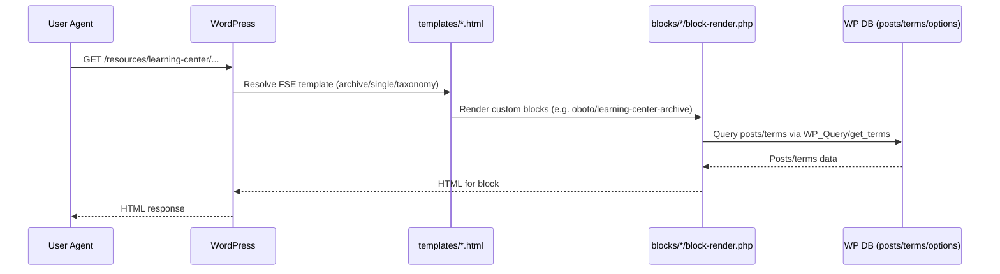
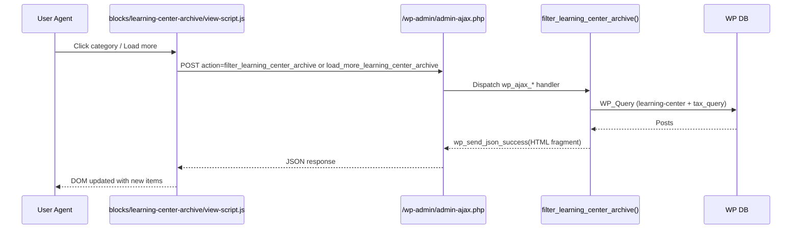

## Architectural shape (as implemented)

- **Type**: WordPress theme with **server-rendered blocks** (ACF render templates) and **client-side enhancements** (JS + jQuery).
- **Primary execution model**: WordPress hooks (`add_action`, `add_filter`) + PHP template rendering (`block-render.php`, `templates/*.html`).

## Layers (practical, theme-oriented)

- **Theme bootstrap layer**
  - `functions.php`: theme supports, global assets, rewrite rules, plugin filters, and module includes.
  - `inc/helpers.php`: block registration and editor block style registration.
- **Domain/content layer**
  - `inc/custom-post-type.php`: registers `learning-center` CPT and `learning-center-category` taxonomy and rewrites.
  - WordPress DB provides persistence for posts, terms, options.
- **Presentation layer**
  - `templates/*.html`, `parts/*.html`: FSE layout composition.
  - `blocks/*/block-render.php`: server-side rendered UI fragments.
  - `patterns/*.php`: reusable block patterns.
- **Interaction layer**
  - `js/script.js`: site-wide behaviors.
  - `blocks/*/view-script.js`: per-block behaviors (filtering, load-more, menu toggles).
- **Integration layer**
  - ACF (field access, options page, block render templates).
  - Contact Form 7 (validation hooks, skip-mail behavior).
  - Yoast canonical filter.
  - WP All Import filters.
  - GitHub Updater filter.
  - Frontend CDNs (Swiper/AOS/Prism/Highlight/GSAP/Lottie).

## Modules / domains (provably present)

- **Learning Center**
  - CPT/taxonomy: `inc/custom-post-type.php`
  - Templates: `templates/archive-learning-center.html`, `templates/single-learning-center.html`, `templates/taxonomy-learning-center-category.html`
  - Blocks:
    - `oboto/learning-center-archive`: server-rendered archive + AJAX category filter / load more (`blocks/learning-center-archive/*`)
    - `oboto/learning-center-single`: server-rendered single view with related posts sidebar (`blocks/learning-center-single/*`)
  - Rewrite maintenance:
    - “rewrite version” flush (`functions.php`)
    - fallback taxonomy rule inserted into `option_rewrite_rules` (`functions.php`)
- **Navigation**
  - `oboto/navigation` block (`blocks/navigation/*`)
  - Custom walker: `Header_Menu_Walker` (`inc/navigations-functions.php`)
  - Depends on ACF fields on menu items (e.g. `icon`, `submenu_type`, `open_in_new_tab`).
- **Blog URL shaping**
  - Permalink override for posts in category `blog` and redirect/canonical alignment (`functions.php`)
- **Forms**
  - Contact Form 7 “skip sending mail” for a specific form hash/title (`functions.php`)
  - Corporate email enforcement via a blocked-domain list + typo detection (Levenshtein) (`inc/class-alison-contact-forms.php`)
  - Disable CF7 automatic `<p>` wrapping (`inc/helpers.php`)
- **Theme settings (admin)**
  - ACF options page `theme-general-settings` (`functions.php`)
  - Field group in `acf-json/group_679915aae0db5.json` (e.g. `header_button`, `cta_1..3`)

## Dependency rules (observed)

- `functions.php` is the **top-level** theme module; it includes `inc/*` and enqueues global assets.
- `inc/helpers.php` **registers all blocks** by scanning `blocks/*` and requiring each block’s `block.php`.
- Each block is self-contained within `blocks/<block-name>/` and may:
  - declare metadata in `block.json`
  - declare server render in `block-render.php`
  - register styles/scripts and hooks in `block.php`
  - implement interactivity in `view-script.js`
- Block render templates depend on:
  - WordPress template context (`global $post`, conditional tags like `is_tax`)
  - ACF field access via `get_field`
  - WordPress querying (`WP_Query`, `get_terms`, `wp_get_post_terms`)

## Module dependency diagram

```mermaid
graph TD
  WP[WordPress runtime] --> F[functions.php]
  F --> INC[inc/*.php]
  INC --> H[inc/helpers.php]
  H --> B[blocks/* (register_block_type + require block.php)]

  B --> BJ[blocks/*/block.json]
  B --> BR[blocks/*/block-render.php]
  B --> BV[blocks/*/view-script.js]

  WP --> T[templates/*.html]
  T --> P[parts/*.html]
  T --> BR

  ACF[ACF plugin] --> BR
  ACF --> INC
  ACF --> AJ[acf-json/*.json]
```

## Request/response flow (page render)



## Job / AJAX processing flow (Learning Center archive)



## TODO: Clarify with tech lead

- Whether any blocks rely on additional plugins beyond ACF + CF7 + Yoast + WP All Import + GitHub Updater (only these are directly referenced in code).
- Expected WordPress and PHP version targets for this theme.
